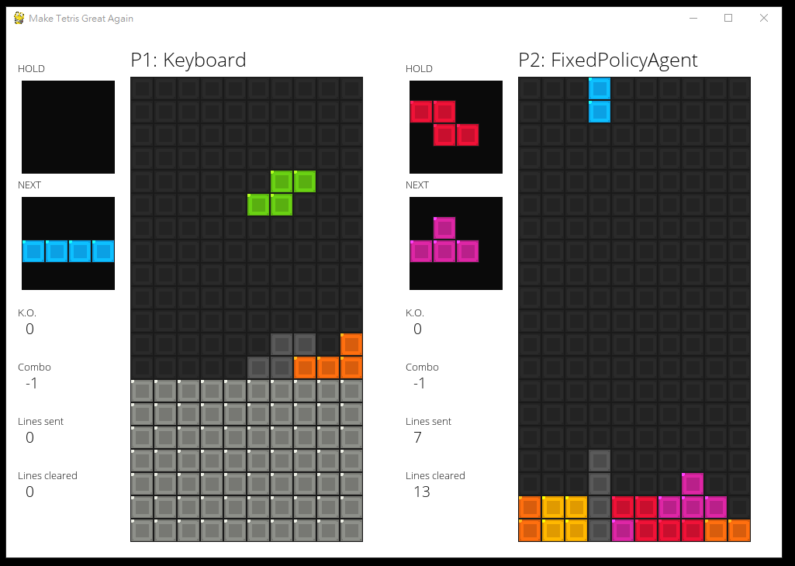

## Tetris Battle AI

Final project for Introduction to Artificial Intellegence (2018 Fall), National Taiwan University

Make Tetris Great Again!



[Video Demo - Human VS Fixed-policy](https://youtu.be/kA84HhI7Rrk)

[Video Demo - Our GA VS Fixed-policy](https://youtu.be/PWYOPw07RgU)


## Introduction

In this project, we build an platform for the **Tetris Battle** game based on [9, 10] and implement several agents to play against one another.

The main difference between the 1-player Tetris and 2-player "Tetris Battle" is that in the 1-player mode, players only need to remove as more lines as possible,
while in the 2-player mode, players need to get more **combos** (clearing lines consecutively) in order to sent garbage lines to knock out (KO) its opponent.

This problem is harder than we though due to the **extremely sparse rewards**; random step-by-step actions could never get a line remove. We help agents get some possible final locations of each blocks and that them learn the strategies. 

**Genetic algorithm (GA), DQN [10], policy gradient and actor-critic (AC) are implemented.** Among them, GA and AC perform well; the AC player will never die in a 1-player game. While they may not beat the baseline [1] in terms of cleared lines, they have a higher chance to win compared to the baseline because they are more stable.

Using rule-based methods [2] should achieve better results for now. However, our learning-based method could have the potential to find a better strategy and could be updated if the rule is changed (e.g., the garbage lines with bomb).

## Installation

1. Install miniconda/anaconda, a package for  package/environment management
```
wget repo.continuum.io/miniconda/Miniconda3-latest-Linux-x86_64.sh
bash Miniconda3-latest-Linux-x86_64.sh
```

2. Build conda environment from file
```
conda env create -f environment.yaml
```

3. Activate the environment
```
source activate AI_Intro_Final
```

## Play the Game

```
$ cd src
$ python global_engine.py -h
pygame 1.9.4
Hello from the pygame community. https://www.pygame.org/contribute.html
usage: global_engine.py [-h] [-ww WIDTH] [-hh HEIGHT] [-n GAME_NUM]
                        [-kn KO_NUM_TO_WIN] [-p PLAYERS [PLAYERS ...]]
                        [-b BLOCK_SIZE] [-g USE_GUI]

optional arguments:
  -h, --help            show this help message and exit
  -ww WIDTH, --width WIDTH
                        Window width
  -hh HEIGHT, --height HEIGHT
                        Window height
  -n GAME_NUM, --game_num GAME_NUM
                        Number of games
  -kn KO_NUM_TO_WIN, --KO_num_to_win KO_NUM_TO_WIN
                        Number of KO to win a game
  -p PLAYERS [PLAYERS ...], --players PLAYERS [PLAYERS ...]
                        List of player type (k: keyboard, g: genetic
                        algorithm, f: fixed-policy, a: actor-critic)
  -b BLOCK_SIZE, --block_size BLOCK_SIZE
                        Set block size to enlarge GUI
  -g USE_GUI, --use_gui USE_GUI
                        Active output to gui

# Example: keyboard vs fixed-policy in the GUI mode
$ python global_engine.py -g 1 -hh 20 -p k f

# Keyboard input is faster using the command line mode
```

## Known Issues

* No T-spin, B2B rules
* Rotation may be limited whet the block is close to boundaries
* When reached the top of the board, the blocks over the top might be removed
* When recieved garbage lines, the blocks at the bottom might be disappeared

## Workflow

Please follow the [Github Flow](https://guides.github.com/introduction/flow/) in this project.

In short, you have to open a new brach for each new feature. If the feature is done, you have to send Pull Request for others to review your code.


## Coding Style

Please follow the [Flake8](http://flake8.pycqa.org/en/latest/) Python standarad in this project.


## Reference

1. Yiyuan Lee, Tetris AI – The (Near) Perfect Bot, https://codemyroad.wordpress.com/2013/04/14/tetris-ai-the-near-perfect-player/, 2013
2. Wei-Tze Tsai, Chi-Hsien Yen, Wei-Chiu Ma, Tian-Li Yu, Tetris Artificial Intelligence, National Taiwan University
3. Niko B hm, Gabriella K kai and Stefan Mandl, An evolutionary approach to Tetris, 6th Metaheuristics International Conference, 2005
4. Amine Boumaza, On the evolution of artificial Tetris players, Computational Intelligence and Games 2009, 2009
5. Tetris Battle Wiki, https://harddrop.com/wiki/Tetris_Battle_(Facebook)
6. David Sliver, Julian Schrittwieser, Mastering the game of GO without human knowledge, DeepMind,2017
7. Learning to play Tetris with Monte Carlo Tree Search and Temporal Difference Learning, https://github.com/hrpan/tetris_mcts 
8. Matt Stevens,  Sabeek Pradhan, Playing Tetris with Deep Reinforcement Learning, Stanford University
9. PYTRIS, https://github.com/k0626089/PYTRIS 
10. TetrisRL, https://github.com/jaybutera/tetrisRL 
11. MCTS figure, http://mcts.ai/about/index.html


## Authors

張雅量 r07944019 [amjltc295](https://github.com/amjltc295/) - Game environment, GUI, 2-player GA/AC

葛學儒 (Patrick) t07902111 - GUI, GA

鄭皓謙 r06922115 - DQN, policy gradient, actor-critic

